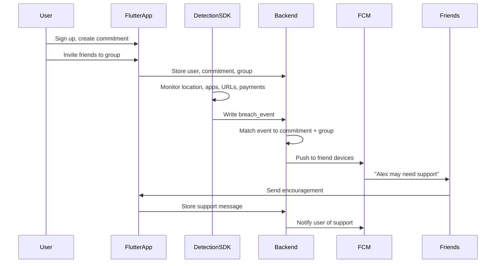
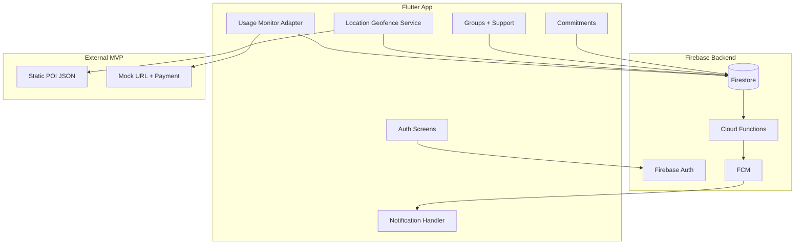
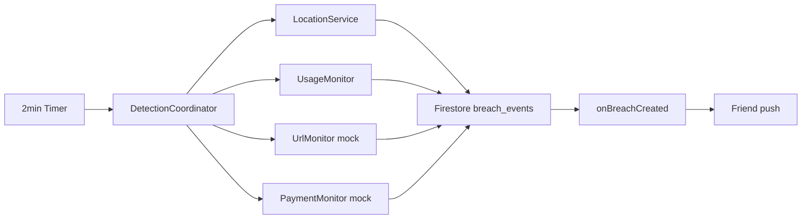

# Gambling Accountability App — System Architecture

## Overview

Flutter + Firebase app that helps users stay accountable for gambling-related commitments by detecting risky behavior (location, apps, URLs, payments) and notifying their friend group so peers can offer social support.

## Product flow



## High-level architecture



## Tech stack

| Layer | Choice |
|-------|--------|
| Mobile | Flutter (iOS + Android) |
| State | Riverpod |
| Routing | go_router |
| Auth | Firebase Auth (email + Google) |
| Database | Cloud Firestore |
| Push | FCM + APNs |
| Backend logic | Cloud Functions (TypeScript) |
| Location | geolocator + static POI database |

## Data model

### `users/{userId}`
- `displayName`, `email`, `fcmToken`, `createdAt`
- `screeningCompleted`, `lastScreeningAt`, `nextScreeningDueAt`, `activeReferralFlags[]`

### `users/{userId}/screenings/{screeningId}`
- `pgsiScore`, `phq2Score`, `gad2Score`, `auditCScore`, `suicideItemScore`
- `pgsiBand`, `referrals[]`, `crisisTriggered`, `screeningVersion`, `completedAt`

## Wellbeing screening flow

Mandatory at signup (PGSI + PHQ-2 + GAD-2 + AUDIT-C + suicide item). Router blocks app access until complete. Suicide endorsement routes to crisis screen with UK helplines. Scores drive refer-on to existing help resources. Re-screen every 8 weeks with in-app prompt on home.

Routes: `/screening`, `/screening/crisis`, `/screening/results`, `/crisis`

### `commitments/{commitmentId}`
- `userId`, `title`, `type` (location | online | spending)
- `rules`: `{ blockedApps[], blockedDomains[], maxSpend?, geofenceRadiusM }`
- `active`, `createdAt`

### `groups/{groupId}`
- `name`, `ownerId`, `memberIds[]`, `inviteCode`, `createdAt`

### `breach_events/{eventId}`
- `userId`, `commitmentId`, `groupId`
- `signalType` (location | app | url | payment | manual)
- `metadata`, `severity`, `acknowledged`, `userName`, `createdAt`

### `support_messages/{messageId}`
- `breachEventId`, `fromUserId`, `toUserId`
- `message`, `type` (encouragement | check_in | call_offer)
- `fromUserName`, `createdAt`

## Two-person module split

### Person A — Mobile App & Social Layer

| Module | Path | Responsibility |
|--------|------|----------------|
| Auth | `lib/features/auth/` | Login, signup, Google sign-in |
| Onboarding | `lib/features/onboarding/` | Feature intro, permission prompts |
| Commitments | `lib/features/commitments/` | Create/list/toggle commitments |
| Groups | `lib/features/groups/` | Create group, invite code, join |
| Support | `lib/features/support/` | Breach inbox, send encouragement |
| Notifications | `lib/core/notifications/` | FCM client registration |
| Theme/Routing | `lib/core/` | App shell |

### Person B — Detection Engine & Backend

| Module | Path | Responsibility |
|--------|------|----------------|
| Cloud Functions | `functions/src/` | Breach + support FCM triggers |
| Firestore rules | `firestore.rules` | Security rules |
| Location | `lib/services/detection/location_service.dart` | GPS geofencing vs POI list |
| Usage monitor | `lib/services/detection/usage_monitor.dart` | Android UsageStats channel |
| URL/Payment mocks | `lib/services/detection/url_payment_monitors.dart` | Simulated signals |
| Coordinator | `lib/services/detection/detection_coordinator.dart` | Periodic checks + cooldown |
| Repositories | `lib/data/repositories/` | Firestore implementations |
| Simulator | `lib/features/dev/breach_simulator.dart` | Demo breach injection |
| POI data | `assets/data/gambling_pois.json` | Casino/betting shop coordinates |

### Shared contract (Day 1 handshake)

```
lib/domain/models/       — BreachEvent, Commitment, FriendGroup, etc.
lib/domain/repositories/ — Abstract interfaces both sides code against
```

Person A builds UI against interfaces; Person B implements Firestore backends.

## Cloud Functions

### `onBreachCreated`
Triggered when a document is created in `breach_events`:
1. Dedupe rapid repeats (15-min cooldown per signal type)
2. Load group members (exclude breacher)
3. Fetch FCM tokens from `users`
4. Send multicast push with breach summary

### `onSupportCreated`
Triggered when a document is created in `support_messages`:
1. Load recipient FCM token
2. Send push: "{friend} sent support"

## Platform constraints (hackathon MVP)

| Signal | Android | iOS | MVP approach |
|--------|---------|-----|--------------|
| GPS near casino/betting shop | Real | Real | `geolocator` + POI JSON |
| Screen time / app usage | UsageStats (with permission) | Blocked (needs Apple entitlement) | Android: real; iOS: simulated |
| Website URLs | Limited | Blocked | Mock via breach simulator |
| Email / SMS | Not viable | Not viable | Phase 2 |
| Payment monitoring | Complex | Complex | Mock via breach simulator |

## Detection flow



Client-side cooldown (15 min) prevents duplicate events; Cloud Function also dedupes.

## Security & privacy

- Firestore rules enforce: users own their profile/commitments; group members read group data; breach events only created by the breaching user
- Payment push notifications never include exact amounts
- Explicit consent screen before location + notification permissions
- No email/SMS content stored in MVP

## Notification payloads

**Breach alert (to friends):**
```json
{
  "type": "breach_alert",
  "eventId": "...",
  "userName": "Alex",
  "signalType": "location",
  "summary": "Near betting shop on High Street",
  "groupId": "..."
}
```

**Support received (to user):**
```json
{
  "type": "support_received",
  "fromName": "Sam",
  "message": "You've got this — call me if you need to talk"
}
```

## Phase 2 (post-hackathon)

- iOS Screen Time via Family Controls (Apple entitlement)
- Open Banking (Plaid/TrueLayer) for transaction categorization
- VPN/DNS domain blocking on Android
- Email/SMS pattern detection (with legal review)
- ML risk scoring across multiple signals

## Repo structure

```
lib/
├── main.dart
├── core/              # theme, routing, notifications (Person A)
├── domain/            # shared models + interfaces
├── data/              # Firestore repos (Person B)
├── features/
│   ├── auth/          # Person A
│   ├── commitments/   # Person A
│   ├── groups/        # Person A
│   ├── support/       # Person A
│   └── dev/           # Person B (simulator)
└── services/
    └── detection/     # Person B
functions/             # Person B
assets/data/           # Person B
firestore.rules        # Person B
docs/ARCHITECTURE.md   # This file
```

## Demo script

1. User signs up, creates commitment: "No betting shops or gambling apps"
2. User creates friend group, shares invite code; friend joins on second device
3. Trigger location breach via simulator (or walk near POI) → friends get push
4. Friend taps notification → sends "I'm here for you"
5. User receives support notification
6. Optional: Android shows real gambling app detection via UsageStats
