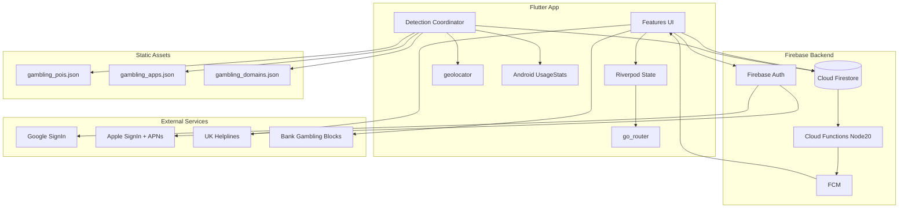
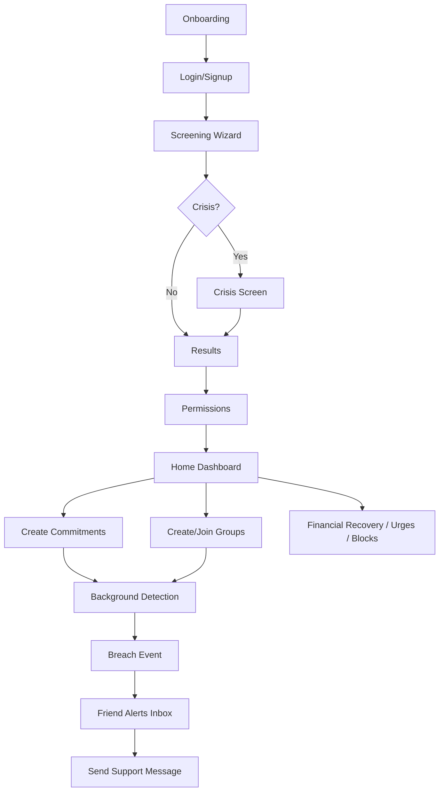

# Lavender Accountability App — Features & Tools Inventory

**Lavender** (package name: `accountability_app`) is a Flutter gambling accountability app with commitments, background breach detection, friend-group peer support, wellbeing screening, financial recovery tools, and gamification. It targets **iOS and Android**, with Firebase backend and a mock mode for local development.

---

## User-Facing Features (16 modules)

### 1. Onboarding & Authentication
- **5-page onboarding carousel** — intro to accountability, location alerts, app monitoring, friend circles, professional help ([`lib/features/onboarding/onboarding_screen.dart`](../lib/features/onboarding/onboarding_screen.dart))
- **Login** — email/password + Google/Apple sign-in ([`lib/features/auth/login_screen.dart`](../lib/features/auth/login_screen.dart))
- **Signup** — account creation, routes to mandatory screening ([`lib/features/auth/signup_screen.dart`](../lib/features/auth/signup_screen.dart))
- **Mock auth mode** — runs without Firebase when `useMockAuth = true` in [`lib/core/config/app_config.dart`](../lib/core/config/app_config.dart)

### 2. Permissions & Device Setup
- Request **location** (geofencing), **push notifications** (FCM), and **Android Usage Access** (app monitoring) ([`lib/features/settings/permissions_screen.dart`](../lib/features/settings/permissions_screen.dart))

### 3. Wellbeing Screening (mandatory after signup)
- Multi-step validated instruments: **PGSI** (gambling), **PHQ-2** (mood), **GAD-2** (anxiety), **AUDIT-C** (alcohol), suicide item ([`lib/services/screening/screening_definitions.dart`](../lib/services/screening/screening_definitions.dart))
- **Crisis flow** — helplines + acknowledgment on high-risk responses ([`lib/features/screening/crisis_screen.dart`](../lib/features/screening/crisis_screen.dart))
- **Results summary** — non-diagnostic scores + referral recommendations ([`lib/features/screening/screening_results_screen.dart`](../lib/features/screening/screening_results_screen.dart))
- **Rescreen prompts** — periodic check-in reminders on Home ([`lib/features/screening/screening_rescreen_prompt.dart`](../lib/features/screening/screening_rescreen_prompt.dart))

### 4. Home Dashboard
- Gamification hero (points, streaks, group rank)
- **Flag for support** — manual breach alert to friend circle
- **Crisis help tile** — one-tap Samaritans, GamCare, NHS 111
- **Positive reminders** — rotating encouragement messages
- Shortcuts to financial recovery, professional help, and milestone notifications ([`lib/features/home/home_screen.dart`](../lib/features/home/home_screen.dart))

### 5. Commitments (Goals tab)
- Create/edit signed commitments with three types:
  - **Location** — geofence near betting venues
  - **Online** — blocked apps/domains
  - **Spending** — max spend threshold
- Toggle active/paused; streak tracking ([`lib/features/commitments/`](../lib/features/commitments/))

### 6. Background Breach Detection (core engine)
Runs every 2 minutes against active commitments ([`lib/services/detection/detection_coordinator.dart`](../lib/services/detection/detection_coordinator.dart)):

| Signal | Detection method |
|--------|-----------------|
| Location | GPS + static POI catalog ([`assets/data/gambling_pois.json`](../assets/data/gambling_pois.json)) |
| App usage | Android `UsageStatsManager` via native Kotlin bridge |
| URL/website | Gambling domain catalog ([`assets/data/gambling_domains.json`](../assets/data/gambling_domains.json)) |
| Payment/spending | Overspend vs commitment limit |
| Manual | User self-flags from Home |

### 7. Friend Groups & Social Accountability
- Create groups with shareable **invite codes**
- Join groups by code
- **Find people** — search users by display name and invite to groups
- Group rank display in Support Hub ([`lib/features/groups/`](../lib/features/groups/), [`lib/features/people/find_people_screen.dart`](../lib/features/people/find_people_screen.dart))

### 8. Alerts & Peer Support (Alerts tab)
- **Alerts inbox** — friend breach events with unread badge
- **Send support** — preset or custom encouragement/check-in/call-offer messages (+5 points)
- **My moments** — user's own breach timeline ([`lib/features/support/my_breaches_screen.dart`](../lib/features/support/my_breaches_screen.dart))
- Demo breach alert in mock mode ([`lib/features/demo/demo_breach_alert.dart`](../lib/features/demo/demo_breach_alert.dart))

### 9. Gamification & Leaderboards
- **Points & tiers** — accountability points with tier badges (1000/1100/1200 thresholds)
- **Streaks** — current and best "days reclaimed"
- **Stats detail** — full progress view ("your journey")
- **Leaderboards** — group or global rankings
- Support bonus points when sending peer support ([`lib/features/gamification/`](../lib/features/gamification/))

### 10. Crisis & Professional Help (Support Hub)
- **Get Help directory** — crisis helplines, licensed support, recovery coaches, self-serve tools
- Resource catalog from [`assets/data/help_resources.json`](../assets/data/help_resources.json)
- Reusable crisis panel (Samaritans, GamCare, NHS 111) ([`lib/features/help/professionals_screen.dart`](../lib/features/help/professionals_screen.dart))

### 11. Financial Recovery
- Debt tracking (estimated debt + amount paid off)
- Savings goals with progress bars
- Monthly spending limit
- Payday tracking (high-risk day reminders)
- Links to debt help (StepChange, National Debtline, Money Helper, Citizens Advice) ([`lib/features/financial_recovery/financial_recovery_screen.dart`](../lib/features/financial_recovery/financial_recovery_screen.dart))

### 12. Block Access & Money Tools
Five configurable barriers ([`lib/features/tools/block_access_screen.dart`](../lib/features/tools/block_access_screen.dart)):
- **GAMSTOP** — UK self-exclusion registration
- **Bank gambling block** — deep links to Barclays, HSBC, Lloyds, NatWest, Monzo, Starling
- **App blocker** — Android Usage Access toggle
- **Website blocker** — domain tracking toggle
- **Spending delay** — configurable cooling-off (15m–24h)

### 13. Urge Tracking & Insights
- **Log an urge** — intensity (1–10), mood, trigger, location, money on hand, resisted/acted, notes
- **Coping prompts** — contextual advice; high-risk routes to crisis screen
- **Urge insights** — pattern analysis (top triggers/moods, resist rate, risky-moment detection) ([`lib/features/urges/`](../lib/features/urges/))

### 14. Push Notifications
- FCM token management, foreground snackbars, background handler
- Deep linking: `breach_alert` → breach detail; `support_received` → home ([`lib/core/notifications/`](../lib/core/notifications/))

### 15. App Shell Navigation
Four bottom tabs via [`lib/core/routing/app_shell.dart`](../lib/core/routing/app_shell.dart):

| Tab | Route | Purpose |
|-----|-------|---------|
| Home | `/home` | Dashboard |
| Goals | `/commitments` | Commitment management |
| Support | `/support-hub` | People, rankings, professional help |
| Alerts | `/support` | Friend breach inbox |

Auth gate in [`lib/core/routing/app_router.dart`](../lib/core/routing/app_router.dart): unauthenticated → onboarding/login; authenticated but not screened → screening wizard.

### 16. Dev / Demo Tools
- **Breach simulator** — trigger test breaches ([`lib/features/dev/breach_simulator_screen.dart`](../lib/features/dev/breach_simulator_screen.dart))
- **Demo Paddy Power alert** — mock notification in Alerts tab

---

## Technologies & Tools Used to Build the App

### Mobile Framework & Language
- **Flutter** (≥3.38.4) — cross-platform UI
- **Dart** (≥3.2.0) — application language
- **Material Design** — UI component system
- **Platforms:** iOS 13.0+, Android minSdk 23, macOS 10.15+ (dev)

### Flutter/Dart Packages ([`pubspec.yaml`](../pubspec.yaml))

**State & Navigation**
- `flutter_riverpod` ^2.5.1 — state management & dependency injection
- `go_router` ^14.2.7 — declarative routing & deep linking

**UI & UX**
- `google_fonts` ^6.2.1 — Poppins typography
- `flutter_animate` ^4.5.0 — motion/animation
- `cupertino_icons` ^1.0.8 — iOS-style icons
- `intl` ^0.19.0 — date/number formatting

**Firebase Client SDK**
- `firebase_core` ^3.6.0
- `firebase_auth` ^5.3.1
- `cloud_firestore` ^5.4.4
- `firebase_messaging` ^15.1.3

**Auth Providers**
- `google_sign_in` ^6.2.1
- `sign_in_with_apple` ^6.1.0
- `crypto` ^3.0.0 — Apple auth nonce

**Device & Permissions**
- `geolocator` ^13.0.1 — GPS for geofencing
- `permission_handler` ^11.3.1 — runtime permissions

**Utilities**
- `shared_preferences` ^2.3.2 — local prefs (onboarding, screening)
- `uuid` ^4.5.1 — ID generation
- `url_launcher` ^6.3.2 — helplines, bank URLs, web resources

**Dev/Quality**
- `flutter_test` — unit & widget tests (7 test files in [`test/`](../test/))
- `flutter_lints` ^4.0.0 — lint rules

### Firebase Backend

**Services**
- **Firebase Auth** — email, Google, Apple
- **Cloud Firestore** — primary database
- **Firebase Cloud Messaging (FCM)** — push notifications
- **Cloud Functions (Gen 2)** — server-side notification triggers
- **APNs** — iOS push via Firebase Console

**Cloud Functions** ([`functions/`](../functions/))
- **Node.js 20** + **TypeScript 5.6**
- `firebase-admin` ^12.6.0, `firebase-functions` ^6.0.1
- `onBreachCreated` — FCM to group members on new breach (15-min dedup)
- `onSupportCreated` — FCM to recipient on new support message

**Config files**
- [`firebase.json`](../firebase.json), [`.firebaserc`](../.firebaserc), [`firestore.rules`](../firestore.rules), [`firestore.indexes.json`](../firestore.indexes.json), [`lib/firebase_options.dart`](../lib/firebase_options.dart)

**Firestore collections:** `users`, `commitments`, `groups`, `breach_events`, `support_messages`, `urge_logs`, `block_settings`, `financial_recovery`, `screenings`

### Native Platform Code

**Android**
- Gradle 9.1.0, Android Gradle Plugin 8.1.0, Kotlin 1.8.22
- Google Services plugin 4.4.2
- Custom **UsageStatsManager** bridge in `MainActivity.kt` (MethodChannel `com.accountability/usage_stats`)

**iOS**
- CocoaPods 1.16.2, Firebase iOS SDK 11.15.0, GoogleSignIn 8.0.0
- Core Location via `geolocator_apple`

### Static Data Assets (no live external APIs)
- [`assets/data/gambling_pois.json`](../assets/data/gambling_pois.json) — betting shop/casino coordinates
- [`assets/data/gambling_apps.json`](../assets/data/gambling_apps.json) — gambling app package names
- [`assets/data/gambling_domains.json`](../assets/data/gambling_domains.json) — gambling website domains
- [`assets/data/help_resources.json`](../assets/data/help_resources.json) — UK helplines & support orgs

### External Services & Integrations
- **Google Sign-In** — OAuth
- **Apple Sign-In + APNs** — OAuth + iOS push
- **UK helplines** — `tel:` URIs (GamCare, Samaritans, NHS 111)
- **UK bank gambling blocks** — deep links (Barclays, HSBC, Lloyds, NatWest, Monzo, Starling)
- **GAMSTOP** — self-exclusion registration URL

**Not used:** maps API, Open Banking, analytics, crash reporting, REST/GraphQL APIs

### Architecture Patterns
- **Clean architecture:** `domain/` (models + interfaces) → `data/` (Firestore + mock repos) → `features/` (UI)
- **Repository pattern** with mock/Firestore swap via Riverpod ([`lib/core/providers/repository_providers.dart`](../lib/core/providers/repository_providers.dart))
- **Detection coordinator** — 2-min polling timer for location + usage monitors

### Deployment & DevOps ([`scripts/`](../scripts/))
- `bootstrap.sh` — Flutter pub get, platform scaffold, functions npm install
- `testflight.sh` / `testflight_setup.sh` / `testflight_release.sh` — TestFlight pipeline
- `apple_portal_checklist.sh`, `apns_firebase_checklist.sh`, `testflight_install_checklist.sh`
- **Tools:** Flutter CLI, Firebase CLI (`firebase-tools`), `flutterfire_cli`, Xcode, CocoaPods
- **No CI/CD** (no GitHub Actions, Fastlane, etc.)

### Documentation
- [`README.md`](../README.md) — quick start, demo flow
- [`docs/ARCHITECTURE.md`](ARCHITECTURE.md) — system design (Mermaid diagrams)
- [`docs/INTEGRATION.md`](INTEGRATION.md) — E2E test guide
- [`docs/DEMO_CHECKLIST.md`](DEMO_CHECKLIST.md) — demo day rehearsal

### Cursor Design Skills (repo tooling, not runtime)
Bundled AI-assisted design toolchain in [`.cursor/skills/`](../.cursor/skills/):

| Skill | Purpose |
|-------|---------|
| `design` | Logo, CIP, slides, banners, icons (Gemini AI) |
| `brand` | Brand voice, visual identity, asset management |
| `design-system` | Token architecture, slide generation |
| `ui-styling` | shadcn/ui + Tailwind CSS guidance |
| `ui-ux-pro-max` | 67 styles, 161 palettes, 99 UX guidelines |
| `slides` | HTML presentations with Chart.js |
| `banner-design` | Social/ad/print banner generation |

Design skill stack: Python 3.10+, Google Gemini API (`google-genai`), Pillow, Chart.js 4.4.1, Tailwind CSS, shadcn/ui CLI, Playwright/Puppeteer

---

## System Architecture

---

## User Journey Summary

---

## Notable Gaps / Phase 2 Items
- `/my-breaches` route exists but has no in-app navigation link
- iOS app usage detection is simulated (Screen Time requires Apple entitlement)
- URL/payment detection partially mocked via breach simulator
- Website blocker tracking only (full DNS/VPN block planned Phase 2)
- Open Banking (Plaid/TrueLayer) mentioned but not implemented
